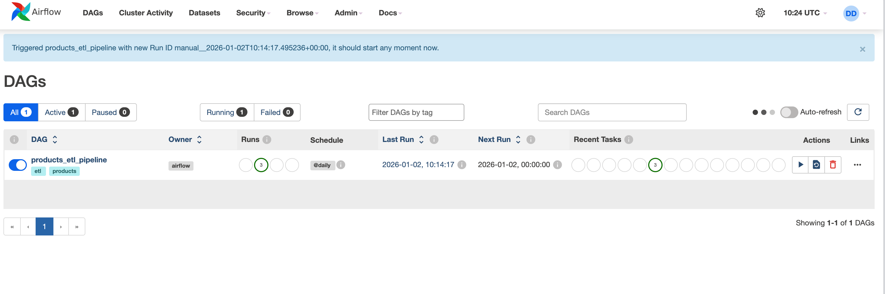
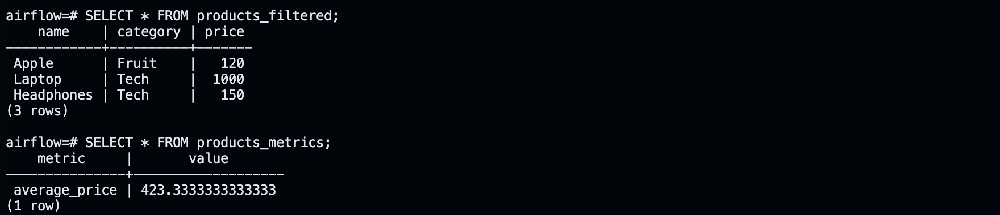

# 🐳 🛠️ 🚀 Airflow Products ETL Pipeline


## A containerized ETL pipeline using **Python, Pandas, Postgres, and Airflow**. 

---

The pipeline:  

1️⃣ Extracts product data from CSV  

2️⃣ Filters products with price > 100  

3️⃣ Cleans data (removes commas)  

4️⃣ Loads filtered data into Postgres  

5️⃣ Prints summary metrics and product names  

---

## 📂 Project Structure


```
airflow-products-project/
│
├─ dags/
│ └─ products_etl_dag.py # Airflow DAG defining the ETL workflow
│
├─ data/
│ └─ products.csv # Sample product dataset
│
├─ docker-compose.yml # Docker Compose setup for Airflow + Postgres
│
├─ README.md # This file
└─ requirements.txt # Python dependencies
```

---

## 🔧 Key Features

- **ETL Workflow**: Extract → Transform → Load  
- **Data Cleaning**: Strips trailing commas in product names & categories  
- **PostgreSQL Integration**: Saves filtered results to `products_filtered` table  
- **Airflow DAG**: Orchestrates daily ETL tasks  
- **Logging & Reporting**: Prints average price & item names  
- **Optional Email Notifications**: Alerts on task success/failure  

---

## 📊 Airflow DAG Overview

**DAG Tasks:**

| Task ID   | Description |
|----------|-------------|
| `extract`  | Read CSV into Pandas DataFrame |
| `transform`| Filter products with price > 100 & clean strings |
| `load`     | Save filtered data to Postgres & print summary |

---


## 🐳 Running Locally (Docker)

1. Start Containers:

```bash
docker compose up -d
```

2. Access Airflow UI:

```bash
"http://localhost:8080"
```

3. Start the scheduler in another terminal:

```bash
docker exec -it <airflow_container_name> airflow scheduler
```

4. Trigger DAG manually in UI ('play' button) or wait for daily run:

5. Verify Postgres tables:

```bash
docker exec -it <airflow_container_name> psql -U airflow -d airflow
```

---

**SQL Commands inside psql**

Show all rows:

```sql
SELECT * FROM products_filtered;
```
Show metrics (average price over 100):


```sql 
`SELECT * FROM products_metrics;`
```


---

**Screenshots:**




<br> 



